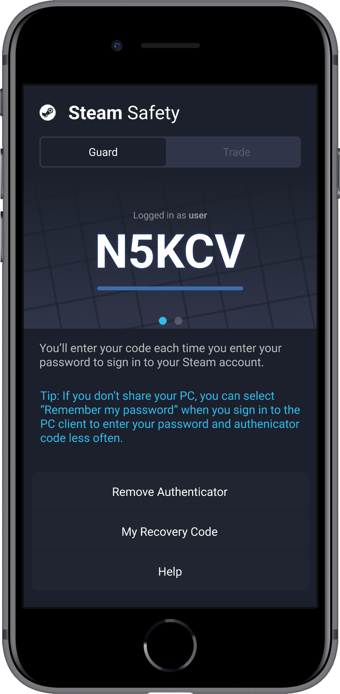

# Guard

**Android**, **IOS** application that protects your **Steam** account from theft. An amateur project with a redesigned design.

## Functional

- [X] Steam Guard File Generation   
- [X] Have unlimited accounts on one device   
- [X] Ability to export a file    
- [X] Ability to import a file    
- [X] Steam Guard Code Generation    
- [X] Authorization    
- [X] Disable Steam Guard from Steam Account     
- [ ] Acceptance, rejection trade

## Design

- [X] Page Login    
- [X] Page Guard   
- [X] View Item Controls    
- [ ] Page Trade
- [X] Page Add Account  

Below are screenshots from IOS, more can be found in [**Figma**](https://www.figma.com/file/NCcKHjj30Wh1UrKvqnby0C/Guard?node-id=0%3A1)

### Info

 - Tested on IOS

 - Tested on Android
